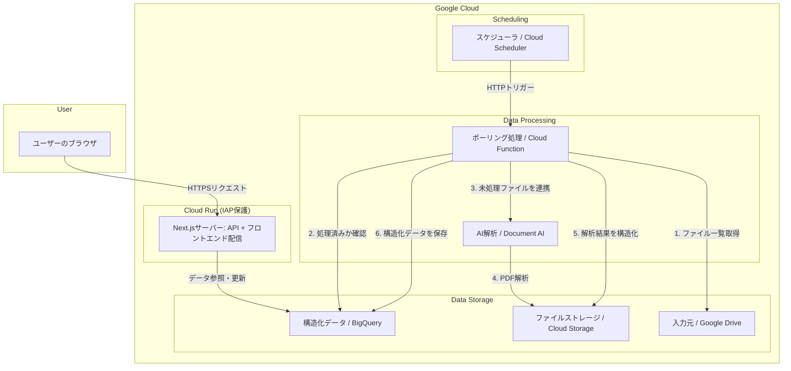
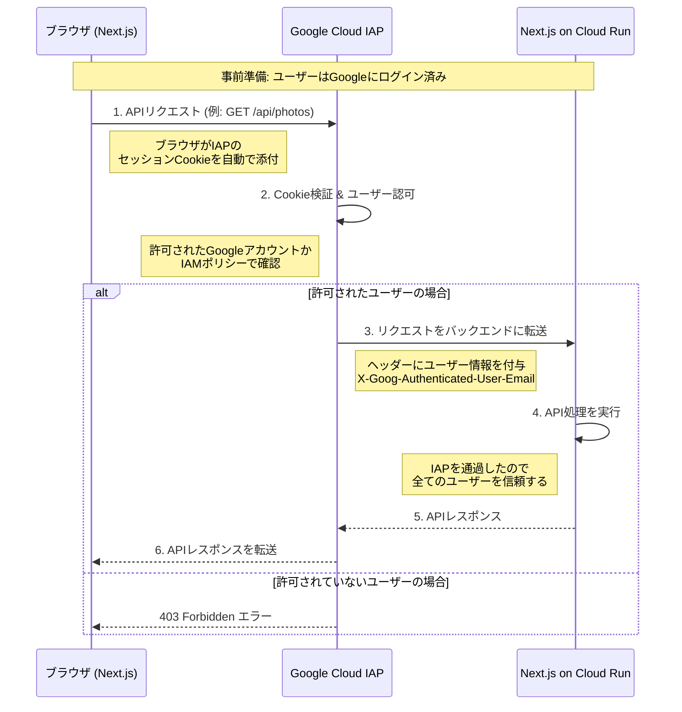
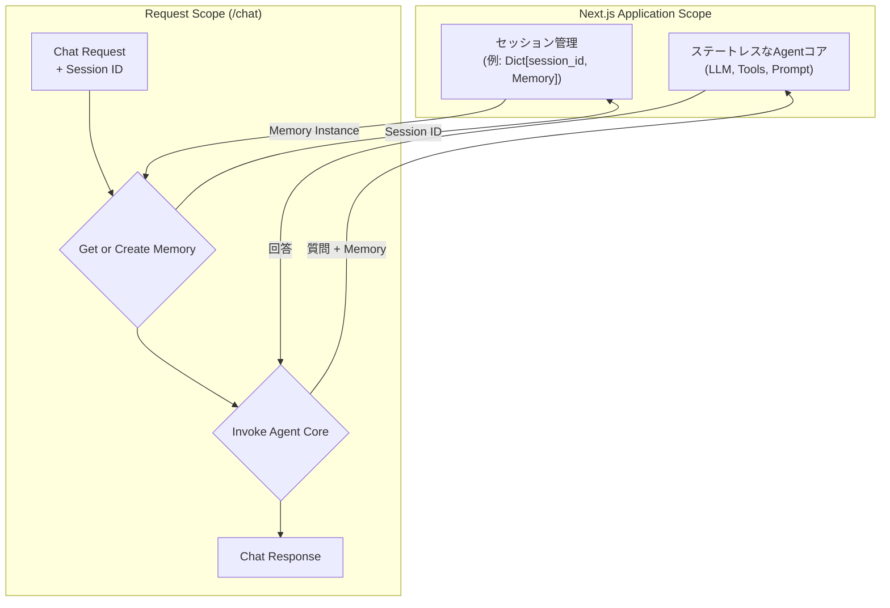

# 設計書

このドキュメントは `requirements.md` に基づくシステム設計を定義します。

## 1. アーキテクチャ概要

本システムは、Google Cloud上に構築されたサーバーレスアーキテクチャを採用します。Cloud Run上で稼働するNext.jsアプリケーションが、フロントエンドとバックエンドAPIの両方を提供し、システム全体がIAPによって保護されます。データ処理は、Cloud Schedulerに定期実行されるCloud Functionが担い、Document AIでの解析結果をBigQueryに蓄積します。

### 1.1. コンポーネント構成図



### 1.2. 処理フロー
1.  **定期的実行**: Cloud Schedulerが設定されたスケジュールで、ポーリング用のCloud FunctionをHTTPトリガーします。
2.  **新規ファイル検出**: Cloud Functionは、Google Drive APIで指定フォルダ内のファイルリストを取得し、BigQueryの処理済み記録と照合して未処理の新規ファイルを特定します。
3.  **解析依頼**: 特定したPDFをCloud Storageにアップロードし、Document AIのプロセッサを呼び出して非同期解析を依頼します。
4.  **データ格納**: 解析結果のJSONをCloud Storageから取得し、`core`モジュールのマッパーを通じてデータモデルに変換後、BigQueryの各テーブルに格納します。

## 2. PDF解析アプローチ

本プロジェクトでは、PDFからのデータ抽出に **Google Cloud Document AI** を採用します。高精度な解析、開発コストの削減、拡張性を理由とします。

## 3. プロジェクト構成

本プロジェクトはNext.js (App Router) の標準的なディレクトリ構造を採用します。フロントエンドのUIコンポーネントとサーバーサイドのAPIエンドポイントが `app/` ディレクトリ内に共存するモノリシックな構成です。

```
/ (project root)
├── app/
│   ├── api/              # API Routes (バックエンドロジック)
│   │   └── chat/
│   │       └── route.ts  # チャットAPIのエンドポイント
│   ├── components/       # Reactコンポーネント
│   ├── layout.tsx        # ルートレイアウト
│   └── page.tsx          # ルートページ
├── public/               # 静的ファイル (画像など)
├── docs/                 # ドキュメント
├── tf/                   # OpenTofu (IaC)
├── next.config.ts        # Next.js設定ファイル
└── package.json          # プロジェクト依存関係
```

## 4. サーバーサイド設計

サーバーサイドのロジックは、Next.jsのApp Routerの機能を用いて実装します。

- **API Routes**:
  - `app/api/` ディレクトリ以下に配置されます。
  - 各APIエンドポイントは `route.ts` (または `.js`) ファイルとして実装され、HTTPリクエストを処理します。例えば、`app/api/chat/route.ts` は `/api/chat` へのリクエストを処理します。
- **サーバーコンポーネント**:
  - デフォルトでサーバーサイドでレンダリングされるReactコンポーネントです。データベースアクセスや外部API呼び出しなどのサーバーサイドロジックをコンポーネント内に直接記述できます。
- **ビジネスロジック・外部連携**:
  - `voltagent/` や `lib/` といったディレクトリに、特定のフレームワークに依存しない純粋なビジネスロジックや、Google Cloud SDKなどの外部サービスと連携するクライアントコードを配置します。
- **Cloud Functions**:
  - 定期実行や非同期処理など、Next.jsのアプリケーションサーバーとは別のライフサイクルで実行する必要がある処理は、Cloud Functionsとして実装し、`functions/` ディレクトリ（別途作成）で管理します。

## 5. データモデル設計 (BigQuery)

TypeScriptの型定義（またはZodスキーマ）をスキーマ定義の原本とし、BigQueryのテーブルスキーマもこれに準拠します。

- **`documents` テーブル**: アップロードされたPDFのメタ情報。
    - `id` (STRING, REQUIRED)
    - `source_drive_id` (STRING, REQUIRED)
    - `source_filename` (STRING, REQUIRED)
    - `document_type` (STRING, REQUIRED)
    - `processed_at` (TIMESTAMP, REQUIRED)

- **`images` テーブル**: 抽出された画像の情報。
    - `id` (STRING, REQUIRED)
    - `document_id` (STRING, REQUIRED)
    - `gcs_path` (STRING, REQUIRED)

- **`calendar_events` テーブル**: カレンダー登録候補の情報。
    - `id` (STRING, REQUIRED)
    - `document_id` (STRING, REQUIRED)
    - `title` (STRING, REQUIRED)
    - `event_date` (DATE, REQUIRED)
    - `description` (STRING)
    - `status` (STRING, REQUIRED)
    - `created_at` (TIMESTAMP, REQUIRED)

- **`journal` テーブル**: `journal`（お知らせ）の構造化データ。
    - `document_id` (STRING, REQUIRED)
    - `title` (STRING)
    - `issue_number` (INTEGER)
    - `published_date` (DATE)
    - `sections` (RECORD, REPEATED)

- **`photo_album` テーブル**: `photo_album`（写真集）の構造化データ。
    - `document_id` (STRING, REQUIRED)
    - `title` (STRING)
    - `author` (STRING)
    - `published_date` (DATE)
    - `nursery_name` (STRING)
    - `childcare_plan` (STRING)

- **`monthly_announcement` テーブル**: `monthly_announcement`（月次お知らせ）の構造化データ。
    - `document_id` (STRING, REQUIRED)
    - `title` (STRING)
    - `preface` (STRING)
    - `schedules` (RECORD, REPEATED)
    - `monthly_goals` (STRING)
    - `sections` (RECORD, REPEATED)

- **`monthly_lunch_schedule` テーブル**: `monthly_lunch_schedule`（月次給食献立表）の構造化データ。
    - `document_id` (STRING, REQUIRED)
    - `month` (STRING)
    - `nursery_name` (STRING)
    - `schedule` (RECORD, REPEATED)
    - `nutrition_summary` (RECORD)

- **`monthly_lunch_info` テーブル**: `monthly_lunch_info`（給食お知らせ）の構造化データ。
    - `document_id` (STRING, REQUIRED)
    - `month` (STRING)
    - `author` (STRING)
    - `preface` (STRING)
    - `sections` (RECORD, REPEATED)

## 6. APIエンドポイント設計 (Next.js API Routes)

APIはIAPによって保護されます。

- `POST /api/chat`: 自然言語での問い合わせに応答するRAGエージェントのエンドポイント。
- `GET /api/calendar/events`: カレンダー登録候補のリストを取得する。
- `POST /api/calendar/events/{event_id}/approve`: 指定されたイベント候補を承認し、Google Calendarに登録する。
- `GET /api/photos`: 抽出された写真の署名付きURLリストを返す。
    - **Query Parameters**:
        - `document_id: Optional[str]`: 掲載ドキュメントID
        - `start_date: Optional[date]`: 掲載日の範囲指定 (開始)
        - `end_date: Optional[date]`: 掲載日の範囲指定 (終了)
        - `offset: int = 0`: ページネーションのオフセット
        - `limit: int = 20`: 1ページあたりの取得件数

## 7. フロントエンド設計

### 7.1. 画面設計とインタラクション
- **ダッシュボード**: AIとの対話とタスク（カレンダー登録）の実行。
- **写真ギャラリー**: 写真の閲覧。

### 7.2. 技術選定
- **フレームワーク**: Next.js
- **UIライブラリ**: Material-UI (MUI)
- **ルーティング**: Next.js App Router
- **データフェッチング**: TanStack Query
- **配信**: Next.js on Cloud Run

### 7.3. フレームワーク選定の経緯
本プロジェクトの要件と技術的制約に基づき、Next.js構成を採用します。

## 8. インフラストラクチャ (IaC)

OpenTofuを用いてGoogle Cloudリソースをコードとして管理します。

### 8.1. Terraformの構成

Terraformのコードは、再利用性と保守性を高めるため、一般的なベストプラクティスである `environments` と `modules` を用いたディレクトリ構成を採用します。

- **`environments`**: `production` や `staging` といった環境ごとの構成を定義します。各環境の `.tf` ファイルは、`modules` を組み合わせてリソースを定義し、環境固有の変数を渡します。
- **`modules`**: Cloud Run、GCS、BigQueryといった、再利用可能なリソースのまとまりを機能単位で定義します。

```
tf/
├── environments/
│   └── production/
│       ├── main.tf         # ルートモジュール: production環境のリソースを定義
│       ├── variables.tf    # production環境用の変数を定義
│       └── outputs.tf      # production環境の出力を定義
└── modules/
    ├── app/              # アプリケーション全体を構成するモジュール
    │   ├── main.tf
    │   ├── variables.tf
    │   └── outputs.tf
    ├── cloud_run/        # Cloud Runサービスを定義するモジュール
    │   └── ...
    ├── gcs/              # GCSバケットを定義するモジュール
    │   └── ...
    └── workload_identity/ # Workload Identity連携を定義するモジュール
        └── ...
```

### 8.2. 主要なリソース

- **コンピューティング/配信**: Cloud Run, Cloud Functions
- **スケジューリング**: Cloud Scheduler
- **AI / ML**: Document AI
- **ストレージ**: Google Drive, Cloud Storage, BigQuery
- **認証**: Identity-Aware Proxy (IAP)

## 9. CI/CD

CI/CDパイプラインにはGitHub Actionsを利用します。

### 9.1. 認証 (Workload Identity)

GitHub ActionsのワークフローからGoogle Cloudへ安全にアクセスするため、Workload Identity連携を利用します。これにより、有効期間の長いサービスアカウントキーをGitHub Secretsに保存する必要がなくなり、セキュリティが向上します。

```mermaid
graph TD
    subgraph GitHub
        A[GitHub Actions Runner] -- "1. OIDCトークンをリクエスト" --> B{GitHub OIDC Provider}
        B -- "2. OIDCトークンを発行" --> A
    end

    subgraph "Google Cloud"
        C[Workload Identity Pool]
        D[Workload Identity Provider]
        E[Service Account]
    end

    A -- "3. OIDCトークンを提示して<br>短期的なGCPアクセストークンを要求" --> C
    C -- "4. トークンの検証を依頼" --> D
    D -- "5. トークンを検証" --> C
    C -- "6. Service Accountの権限を借用" --> E
    E -- "7. 短期的なGCPアクセストークンを発行" --> C
    C -- "8. 短期的なGCPアクセストークンを返却" --> A

    A -- "9. GCPアクセストークンを使って<br>Tofuコマンドなどを実行" --> F[Google Cloud APIs<br>(e.g., GCS, Cloud Run)]

    linkStyle 0,1,2,3,4,5,6,7,8 stroke-width:2px,fill:none,stroke:blue;
```

### 9.2. デプロイフロー

個人プロジェクトとして、ステージング環境を介さずに本番環境へ直接デプロイするシンプルな運用を前提とします。ただし、安全性を確保するため、本番環境への変更適用前には必ず手動での承認プロセスを挟みます。

#### Pull Requestでの変更内容の確認 (CI)
`feature`ブランチから`main`ブランチへのPull Requestを作成した際に、以下のジョブを自動実行します。

- **ユニットテスト:** バックエンドとフロントエンドのユニットテストを実行します。
- **`tofu plan`:** 本番環境に対する`tofu plan`を実行し、インフラの変更計画をPull Request上にコメントとして投稿します。

これにより、マージ前にコードの品質とインフラの変更内容をレビューできます。

#### mainブランチへのマージと手動承認による本番デプロイ (CD)
Pull Requestを`main`ブランチにマージすると、デプロイワークフローが開始されます。

- **トリガー:** `main`ブランチへのPush
- **実行ジョブ:**
    1. **イメージビルド:** アプリケーションのDockerイメージをビルドし、Google Artifact Registryにプッシュします。
    2. **`tofu plan`:** `apply`直前の最終的な変更計画を生成します。
    3. **手動承認:** パイプラインを一時停止し、手動での承認クリックを要求します。これにより、意図しないデプロイを防ぎます。
    4. **`tofu apply`:** 承認が行われた場合にのみ、`tofu apply`を実行して本番環境に変更を適用します。

## 10. 認証・認可設計

本システムは、Google Cloud IAP (Identity-Aware Proxy) を用いて認証と認可を一元的に管理する。個人的なツールであり、アクセスが許可された利用者は全員が同等の権限を持つため、アプリケーションレベルでのロールベースアクセス制御（RBAC）は実装しない。

### 9.1. 処理フロー

フロントエンドとバックエンドAPIは単一のCloud Runサービス上で稼働し、その全体がIAPによって保護される。ユーザーがAPIを呼び出す際の処理フローは以下の通り。



### 9.2. 各コンポーネントの役割

-   **ブラウザ (フロントエンド)**
    -   ユーザーが最初にアクセスした際にIAPから払い出されたセッションCookieを保持する。
    -   バックエンドAPIを呼び出す際、特別な実装なしに、ブラウザが自動でCookieをリクエストに添付する。

-   **Google Cloud IAP**
    -   システムへの全アクセスの窓口となる。
    -   リクエストに含まれるCookieを検証し、ユーザーを **認証** する。
    -   認証されたユーザーのGoogleアカウントが、IAMで許可されたプリンシパルに含まれているかを確認し、 **認可** する。
    -   許可されたリクエストのみをバックエンドに転送する。その際、`X-Goog-Authenticated-User-Email` ヘッダーにユーザーのメールアドレスを付与する。

-   **Next.js (バックエンド)**
    -   IAPを通過したリクエストは全て「認証・認可済み」であると信頼する。
    -   アプリケーションレベルでの追加の認可チェックは行わない。
    -   操作ログの記録などの目的で、必要に応じて `X-Goog-Authenticated-User-Email` ヘッダーを参照することができる。

## 10. RAGエージェント設計 (VoltAgent)

`POST /chat` エンドポイントは、ユーザーからの自然言語での問い合わせに応答するRAG (Retrieval-Augmented Generation) エージェントとして機能する。このエージェントはVoltAgentを用いて構築し、Next.jsアプリケーションに組み込む。

### 10.1. アーキテクチャと状態管理

複数ユーザー・複数セッションからの同時アクセスを安全に処理するため、エージェントの状態管理を明確に分離する。会話履歴のようなステートフルなコンポーネント (`Memory`) はセッションごとに独立させ、エージェントのコアロジックはステートレスなシングルトンとして実装する。



### 10.2. コンポーネント詳細

#### 10.2.1. LLM (大規模言語モデル)

-   **実装**: VoltAgentが提供するLLMラッパーを介して、Googleの **Gemini** モデルを利用する。
-   **役割**: `BigQuery Retriever Tool` によって検索されたコンテキスト情報、プロンプトテンプレート、および会話履歴に基づき、自然で適切な回答を生成する。

#### 10.2.2. BigQuery Retriever Tool

-   **実装**: VoltAgentの`Tool`クラスを継承したカスタムツールとして実装する。このツールは、内部でTypeScript用の `@google-cloud/bigquery` ライブラリを使用する。
-   **役割**: RAGの「Retriever」としての責務を担う。
-   **処理フロー**:
    1.  エージェントからユーザーの質問文字列を受け取る。
    2.  質問内容からキーワードやエンティティを抽出し、検索条件を組み立てる。（初期実装では単純なキーワードマッチングとし、将来的にLLMを用いたより高度なクエリ生成も検討する）
    3.  `documents`, `journal`, `monthly_announcement` など、複数のBigQueryテーブルに対し、テキストカラムを対象とした `SELECT` 文（`WHERE ... LIKE ...`）を実行する。
    4.  得られた検索結果（テーブルの行データ）を、LLMが理解しやすいように整形されたテキスト（コンテキスト情報）に変換してエージェントに返す。

#### 10.2.3. Memory (会話履歴)

-   **実装**: VoltAgentが提供する標準のインメモリ会話バッファ（例: `ConversationBufferMemory`）を利用する。
-   **役割**: ユーザーセッションごとの短期的な会話の文脈を維持する。このインスタンスはステートフルであり、セッションごとに独立して生成・管理される。

#### 10.2.4. Agent Core (エージェントコア)

-   **実装**: LLM、ツール群 (`BigQuery Retriever Tool`など)、プロンプトテンプレートから構成される、**ステートレス**なコンポーネント。
-   **役割**: リクエストごとに、外部から渡される `Memory` インスタンスとユーザーの質問に基づき、応答生成のオーケストレーションを行う。このコア部分は状態を持たないため、アプリケーション全体でシングルトンとして安全に共有できる。

### 10.3. Next.jsとの連携

-   **起動時**:
    -   ステートレスな `Agent Core` を一度だけ初期化する。
    -   セッションごとの `Memory` インスタンスを保持するためのグローバルな辞書 (`sessions: Dict[str, Memory] = {}`) を準備する。
-   **リクエスト処理 (`/api/chat`)**:
    1.  リクエスト（ヘッダーやボディ）からセッションIDを取得する。セッションIDがない場合は新規に発行する。
    2.  セッションIDをキーに、グローバルな辞書から対応する `Memory` インスタンスを取得する。存在しない場合は新しい `Memory` インスタンスを作成し、辞書に格納する。
    3.  `Agent Core` の実行メソッドに、ユーザーの質問と取得した `Memory` インスタンスを渡して呼び出す。
    4.  生成された応答をJSON形式でクライアントに返す。
