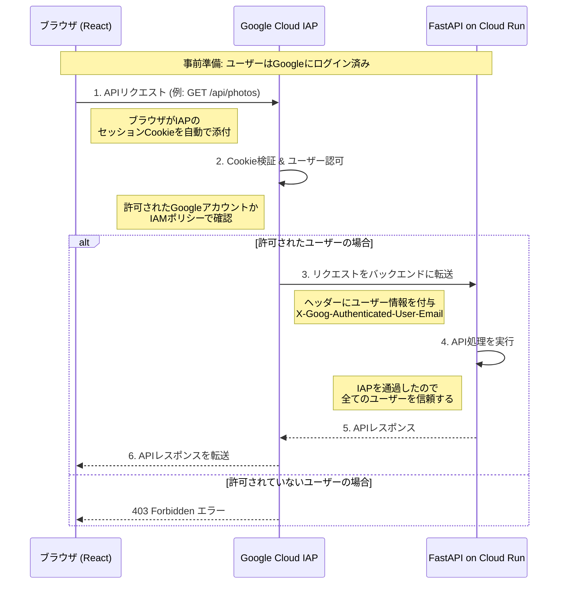

# 設計書

このドキュメントは `requirements.md` に基づくシステム設計を定義します。

## 1. アーキテクチャ概要

本システムは、Google Cloud上に構築されたサーバーレスアーキテクチャを採用します。Cloud Run上で稼働するFastAPIアプリケーションが、Reactで構築されたフロントエンドとバックエンドAPIの両方を提供し、システム全体がIAPによって保護されます。データ処理は、Cloud Schedulerに定期実行されるCloud Functionが担い、Document AIでの解析結果をBigQueryに蓄積します。

### 1.1. コンポーネント構成図


### 1.2. 処理フロー
1.  **定期的実行**: Cloud Schedulerが設定されたスケジュールで、ポーリング用のCloud FunctionをHTTPトリガーします。
2.  **新規ファイル検出**: Cloud Functionは、Google Drive APIで指定フォルダ内のファイルリストを取得し、BigQueryの処理済み記録と照合して未処理の新規ファイルを特定します。
3.  **解析依頼**: 特定したPDFをCloud Storageにアップロードし、Document AIのプロセッサを呼び出して非同期解析を依頼します。
4.  **データ格納**: 解析結果のJSONをCloud Storageから取得し、`core`モジュールのマッパーを通じてPydanticモデルに変換後、BigQueryの各テーブルに格納します。

## 2. PDF解析アプローチ

本プロジェクトでは、PDFからのデータ抽出に **Google Cloud Document AI** を採用します。高精度な解析、開発コストの削減、拡張性を理由とします。

## 3. プロジェクト構成

バックエンドとフロントエンドは、開発時は明確に分離したモノレポ構成とします。本番デプロイ時は、`frontend` ディレクトリでビルドされた静的ファイル群 (`dist` ディレクトリ) が `backend` のコンテナイメージに含まれ、FastAPIによって配信されます。

```
/ (project root)
├── backend/
│   ├── src/
│   └── functions/
├── frontend/
│   └── src/
├── tf/
├── docs/
└── .gitignore
```

## 4. バックエンド モジュール設計

- `backend/src/`
    - `main.py`: FastAPIアプリケーションのエントリーポイント。
    - `config.py`: 環境変数など、アプリケーション全体の設定を管理します。
    - `api/`: APIエンドポイント（ルーター）を配置します。
    - `schemas/`: Pydanticスキーマ（データ構造）を定義します。
    - `core/`: フレームワーク等に依存しない、純粋なビジネスロジック（ドメインロジック）を配置します。
    - `services/`: 具体的なユースケースを実現する層です。横断的な関心事もここに配置します。
    - `clients/`: Google Cloudなど、外部サービスのAPIを呼び出すクライアントを配置します。

- `backend/functions/`:
    - `main.py`: Cloud Functionのデプロイ用エントリーポイント。`backend/src/` 内のコンポーネントを呼び出します。

## 5. データモデル設計 (Pydantic & BigQuery)

Pydanticモデルをスキーマ定義の原本とし、BigQueryのテーブルスキーマもこれに準拠します。

- **`documents` テーブル**: アップロードされたPDFのメタ情報。
    - `id` (STRING, REQUIRED)
    - `source_drive_id` (STRING, REQUIRED)
    - `source_filename` (STRING, REQUIRED)
    - `document_type` (STRING, REQUIRED)
    - `processed_at` (TIMESTAMP, REQUIRED)

- **`images` テーブル**: 抽出された画像の情報。
    - `id` (STRING, REQUIRED)
    - `document_id` (STRING, REQUIRED)
    - `gcs_path` (STRING, REQUIRED)

- **`calendar_events` テーブル**: カレンダー登録候補の情報。
    - `id` (STRING, REQUIRED)
    - `document_id` (STRING, REQUIRED)
    - `title` (STRING, REQUIRED)
    - `event_date` (DATE, REQUIRED)
    - `description` (STRING)
    - `status` (STRING, REQUIRED)
    - `created_at` (TIMESTAMP, REQUIRED)

- **`journal` テーブル**: `journal`（お知らせ）の構造化データ。
    - `document_id` (STRING, REQUIRED)
    - `title` (STRING)
    - `issue_number` (INTEGER)
    - `published_date` (DATE)
    - `sections` (RECORD, REPEATED)

- **`photo_album` テーブル**: `photo_album`（写真集）の構造化データ。
    - `document_id` (STRING, REQUIRED)
    - `title` (STRING)
    - `author` (STRING)
    - `published_date` (DATE)
    - `nursery_name` (STRING)
    - `childcare_plan` (STRING)

- **`monthly_announcement` テーブル**: `monthly_announcement`（月次お知らせ）の構造化データ。
    - `document_id` (STRING, REQUIRED)
    - `title` (STRING)
    - `preface` (STRING)
    - `schedules` (RECORD, REPEATED)
    - `monthly_goals` (STRING)
    - `sections` (RECORD, REPEATED)

- **`monthly_lunch_schedule` テーブル**: `monthly_lunch_schedule`（月次給食献立表）の構造化データ。
    - `document_id` (STRING, REQUIRED)
    - `month` (STRING)
    - `nursery_name` (STRING)
    - `schedule` (RECORD, REPEATED)
    - `nutrition_summary` (RECORD)

- **`monthly_lunch_info` テーブル**: `monthly_lunch_info`（給食お知らせ）の構造化データ。
    - `document_id` (STRING, REQUIRED)
    - `month` (STRING)
    - `author` (STRING)
    - `preface` (STRING)
    - `sections` (RECORD, REPEATED)

## 6. APIエンドポイント設計 (FastAPI)

APIはIAPによって保護されます。

- `POST /chat`: 自然言語での問い合わせに応答するRAGエージェントのエンドポイント。
- `GET /calendar/events`: カレンダー登録候補のリストを取得する。
- `POST /calendar/events/{event_id}/approve`: 指定されたイベント候補を承認し、Google Calendarに登録する。
- `GET /photos`: 抽出された写真の署名付きURLリストを返す。
    - **Query Parameters**:
        - `document_id: Optional[str]`: 掲載ドキュメントID
        - `start_date: Optional[date]`: 掲載日の範囲指定 (開始)
        - `end_date: Optional[date]`: 掲載日の範囲指定 (終了)
        - `offset: int = 0`: ページネーションのオフセット
        - `limit: int = 20`: 1ページあたりの取得件数

## 7. フロントエンド設計

### 7.1. 画面設計とインタラクション
- **ダッシュボード**: AIとの対話とタスク（カレンダー登録）の実行。
- **写真ギャラリー**: 写真の閲覧。

### 7.2. 技術選定
- **フレームワーク**: React (Vite)
- **UIライブラリ**: Material-UI (MUI)
- **ルーティング**: React Router
- **データフェッチング**: TanStack Query
- **配信**: FastAPI on Cloud Run

### 7.3. フレームワーク選定の経緯
本プロジェクトの要件（認証下の内部アプリ、バックエンド分離）と、開発・メンテナンスの安定性を考慮し、Next.jsではなくVite + React構成を採用します。

## 8. インフラストラクチャとCI/CD

- **コンピューティング/配信**: Cloud Run, Cloud Functions
- **スケジューリング**: Cloud Scheduler
- **AI / ML**: Document AI
- **ストレージ**: Google Drive, Cloud Storage, BigQuery
- **認証**: Identity-Aware Proxy (IAP)
- **CI/CD**: GitHub Actions

## 9. 認証・認可設計

本システムは、Google Cloud IAP (Identity-Aware Proxy) を用いて認証と認可を一元的に管理する。個人的なツールであり、アクセスが許可された利用者は全員が同等の権限を持つため、アプリケーションレベルでのロールベースアクセス制御（RBAC）は実装しない。

### 9.1. 処理フロー

フロントエンドとバックエンドAPIは単一のCloud Runサービス上で稼働し、その全体がIAPによって保護される。ユーザーがAPIを呼び出す際の処理フローは以下の通り。



### 9.2. 各コンポーネントの役割

-   **ブラウザ (フロントエンド)**
    -   ユーザーが最初にアクセスした際にIAPから払い出されたセッションCookieを保持する。
    -   バックエンドAPIを呼び出す際、特別な実装なしに、ブラウザが自動でCookieをリクエストに添付する。

-   **Google Cloud IAP**
    -   システムへの全アクセスの窓口となる。
    -   リクエストに含まれるCookieを検証し、ユーザーを **認証** する。
    -   認証されたユーザーのGoogleアカウントが、IAMで許可されたプリンシパルに含まれているかを確認し、 **認可** する。
    -   許可されたリクエストのみをバックエンドに転送する。その際、`X-Goog-Authenticated-User-Email` ヘッダーにユーザーのメールアドレスを付与する。

-   **FastAPI (バックエンド)**
    -   IAPを通過したリクエストは全て「認証・認可済み」であると信頼する。
    -   アプリケーションレベルでの追加の認可チェックは行わない。
    -   操作ログの記録などの目的で、必要に応じて `X-Goog-Authenticated-User-Email` ヘッダーを参照することができる。

## 10. RAGエージェント設計 (ADK)

`POST /chat` エンドポイントは、ユーザーからの自然言語での問い合わせに応答するRAG (Retrieval-Augmented Generation) エージェントとして機能する。このエージェントはGoogleのAgent Development Kit (ADK) を用いて構築し、FastAPIアプリケーションに組み込む。

### 10.1. アーキテクチャと状態管理

複数ユーザー・複数セッションからの同時アクセスを安全に処理するため、エージェントの状態管理を明確に分離する。会話履歴のようなステートフルなコンポーネント (`Memory`) はセッションごとに独立させ、エージェントのコアロジックはステートレスなシングルトンとして実装する。


### 10.2. コンポーネント詳細

#### 10.2.1. LLM (大規模言語モデル)

-   **実装**: ADKが提供するLLMラッパーを介して、Googleの **Gemini** モデルを利用する。
-   **役割**: `BigQuery Retriever Tool` によって検索されたコンテキスト情報、プロンプトテンプレート、および会話履歴に基づき、自然で適切な回答を生成する。

#### 10.2.2. BigQuery Retriever Tool

-   **実装**: ADKの `Tool` クラスを継承したカスタムツールとして実装する。このツールは、内部でPython用の `google-cloud-bigquery` ライブラリを使用する。
-   **役割**: RAGの「Retriever」としての責務を担う。
-   **処理フロー**:
    1.  エージェントからユーザーの質問文字列を受け取る。
    2.  質問内容からキーワードやエンティティを抽出し、検索条件を組み立てる。（初期実装では単純なキーワードマッチングとし、将来的にLLMを用いたより高度なクエリ生成も検討する）
    3.  `documents`, `journal`, `monthly_announcement` など、複数のBigQueryテーブルに対し、テキストカラムを対象とした `SELECT` 文（`WHERE ... LIKE ...`）を実行する。
    4.  得られた検索結果（テーブルの行データ）を、LLMが理解しやすいように整形されたテキスト（コンテキスト情報）に変換してエージェントに返す。

#### 10.2.3. Memory (会話履歴)

-   **実装**: ADKが提供する標準のインメモリ会話バッファ（例: `ConversationBufferMemory`）を利用する。
-   **役割**: ユーザーセッションごとの短期的な会話の文脈を維持する。このインスタンスはステートフルであり、セッションごとに独立して生成・管理される。

#### 10.2.4. Agent Core (エージェントコア)

-   **実装**: LLM、ツール群 (`BigQuery Retriever Tool`など)、プロンプトテンプレートから構成される、**ステートレス**なコンポーネント。
-   **役割**: リクエストごとに、外部から渡される `Memory` インスタンスとユーザーの質問に基づき、応答生成のオーケストレーションを行う。このコア部分は状態を持たないため、アプリケーション全体でシングルトンとして安全に共有できる。

### 10.3. FastAPIとの連携

-   **起動時**:
    -   ステートレスな `Agent Core` を一度だけ初期化する。
    -   セッションごとの `Memory` インスタンスを保持するためのグローバルな辞書 (`sessions: Dict[str, Memory] = {}`) を準備する。
-   **リクエスト処理 (`/chat`)**:
    1.  リクエスト（ヘッダーやボディ）からセッションIDを取得する。セッションIDがない場合は新規に発行する。
    2.  セッションIDをキーに、グローバルな辞書から対応する `Memory` インスタンスを取得する。存在しない場合は新しい `Memory` インスタンスを作成し、辞書に格納する。
    3.  `Agent Core` の実行メソッドに、ユーザーの質問と取得した `Memory` インスタンスを渡して呼び出す。
    4.  生成された応答をJSON形式でクライアントに返す。