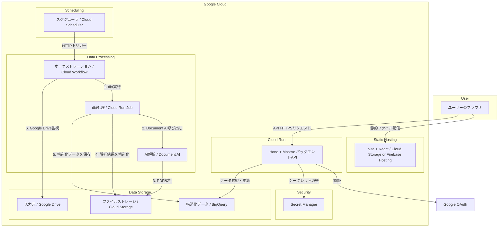

## 1. アーキテクチャ概要

本システムは、Google Cloud上に構築されたサーバーレスアーキテクチャを採用します。フロントエンドはVite + Reactで構築され、静的ファイルとしてCloud Storage（またはFirebase Hosting）でホスティングされます。バックエンドAPIはHono + Mastraで構築され、Cloud Run上で稼働します。認証はHonoのOAuthプロバイダーを利用したGoogle認証を採用します。データ処理は、Cloud Schedulerに定期実行されるCloud Workflowが担い、Document AIでの解析結果をBigQueryに蓄積します。

### 1.1. コンポーネント構成図

### 1.2. 処理フロー
1.  **定期的実行**: Cloud Schedulerが設定されたスケジュールで、Cloud WorkflowをHTTPトリガーします。
2.  **新規ファイル検出**: Google Apps ScriptがGoogle Drive APIで指定フォルダ内のファイルリストを取得し、新規ファイルをCloud Storageにアップロードします。
3.  **解析・構造化**: Cloud Workflowがdbt（Cloud Run Job）を実行し、BigQuery上でDocument AIを呼び出してPDF解析を行い、結果をテーブルに格納します。
4.  **データ変換**: dbtモデルがテキスト抽出、チャンク化、埋め込み生成、文書種別の構造化を順次実行します。
