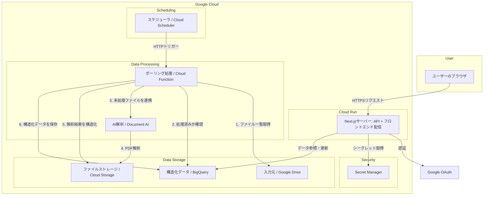

## 1. アーキテクチャ概要

本システムは、Google Cloud上に構築されたサーバーレスアーキテクチャを採用します。Cloud Run上で稼働するNext.jsアプリケーションが、フロントエンドとバックエンドAPIの両方を提供します。認証にはAuth.jsを利用したGoogle認証を採用します。データ処理は、Cloud Schedulerに定期実行されるCloud Functionが担い、Document AIでの解析結果をBigQueryに蓄積します。

### 1.1. コンポーネント構成図

### 1.2. 処理フロー
1.  **定期的実行**: Cloud Schedulerが設定されたスケジュールで、ポーリング用のCloud FunctionをHTTPトリガーします。
2.  **新規ファイル検出**: Cloud Functionは、Google Drive APIで指定フォルダ内のファイルリストを取得し、BigQueryの処理済み記録と照合して未処理の新規ファイルを特定します。
3.  **解析依頼**: 特定したPDFをCloud Storageにアップロードし、Document AIのプロセッサを呼び出して非同期解析を依頼します。
4.  **データ格納**: 解析結果のJSONをCloud Storageから取得し、`core`モジュールのマッパーを通じてデータモデルに変換後、BigQueryの各テーブルに格納します。
