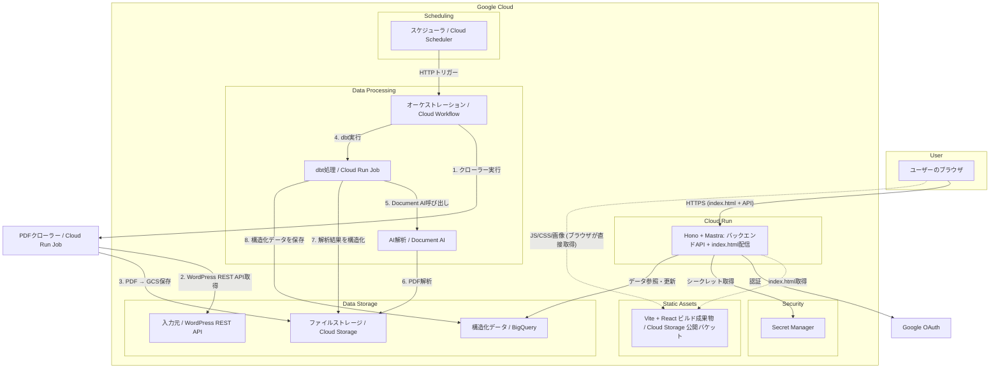

## 1. アーキテクチャ概要

本システムは、Google Cloud上に構築されたサーバーレスアーキテクチャを採用します。フロントエンドはVite + Reactで構築され、バックエンド（Hono on Cloud Run）が`index.html`を配信し、JS/CSSなどの静的アセットはCloud Storage（公開バケット）から直接配信されます（Cloud Load Balancer不使用によるコスト削減）。認証はHonoのOAuthプロバイダーを利用したGoogle認証を採用します。データ処理は、Cloud Schedulerに定期実行されるCloud Workflowが担い、Document AIでの解析結果をBigQueryに蓄積します。

### 1.1. コンポーネント構成図

```mermaid
graph TD
    subgraph User
        U[ユーザーのブラウザ]
    end

    subgraph "Google Cloud"
        subgraph "Cloud Run"
            BE[Hono + Mastra: バックエンドAPI + index.html配信]
        end
        subgraph "Static Assets"
            FE[Vite + React ビルド成果物 / Cloud Storage 公開バケット]
        end
        subgraph "Data Processing"
            C[dbt処理 / Cloud Run Job]
            D[AI解析 / Document AI]
            W[オーケストレーション / Cloud Workflow]
        end
        subgraph "Data Storage"
            E[構造化データ / BigQuery]
            F[ファイルストレージ / Cloud Storage]
            G[入力元 / WordPress REST API]
        end
        subgraph "Scheduling"
            H[スケジューラ / Cloud Scheduler]
        end
        subgraph "Security"
            I[Secret Manager]
        end
    end

    U -- "HTTPS (index.html + API)" --> BE
    U -. "JS/CSS/画像 (ブラウザが直接取得)" .-> FE
    BE -. "index.html取得" .-> FE
    BE -- "認証" --> Google[Google OAuth]
    BE -- "シークレット取得" --> I
    BE -- "データ参照・更新" --> E
    H -- "HTTPトリガー" --> W
    W -- "1. クローラー実行" --> CR[PDFクローラー / Cloud Run Job]
    CR -- "2. WordPress REST API取得" --> G
    CR -- "3. PDF → GCS保存" --> F
    W -- "4. dbt実行" --> C
    C -- "5. Document AI呼び出し" --> D
    D -- "6. PDF解析" --> F
    C -- "7. 解析結果を構造化" --> F
    C -- "8. 構造化データを保存" --> E
```

### 1.2. 処理フロー
1.  **定期的実行**: Cloud Schedulerが設定されたスケジュールで、Cloud WorkflowをHTTPトリガーします（6時間ごと）。
2.  **新規PDF取得**: Cloud WorkflowがクローラーCloud Run Jobを起動し、WordPressサイトのREST APIから新着PDFを検出してGCSの `web/` プレフィックス配下にアップロードします。
3.  **解析・構造化**: Cloud Workflowがdbt（Cloud Run Job）を実行し、BigQuery上でGemini（ML.GENERATE_TEXT）を呼び出してPDF解析を行い、結果をテーブルに格納します。
4.  **データ変換**: dbtモデルがテキスト抽出、チャンク化、埋め込み生成、文書種別の構造化を順次実行します。
