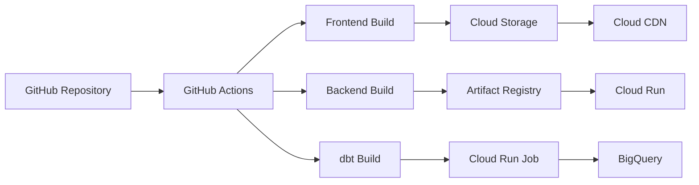

## 9. CI/CD

CI/CDパイプラインにはGitHub Actionsを利用します。フロントエンドとバックエンドは独立してビルド・デプロイされます。

### 9.1. アーキテクチャ概要



### 9.2. フロントエンド (Vite + React)

#### ビルドフロー
1. **Viteビルド**: `npm run build` で静的ファイルを生成（`dist/`ディレクトリ）
2. **Cloud Storageアップロード**: `dist/`の内容をGCSバケットにアップロード
3. **Cloud CDN無効化**: キャッシュをクリアして即座に反映

#### GitHub Actions ワークフロー例

```yaml
name: Deploy Frontend

on:
  push:
    branches:
      - main
    paths:
      - 'frontend/**'

jobs:
  deploy:
    runs-on: ubuntu-latest

    permissions:
      contents: read
      id-token: write

    steps:
      - name: Checkout code
        uses: actions/checkout@v4

      - name: Setup Node.js
        uses: actions/setup-node@v4
        with:
          node-version: '20'
          cache: 'npm'
          cache-dependency-path: frontend/package-lock.json

      - name: Install dependencies
        working-directory: frontend
        run: npm ci

      - name: Build
        working-directory: frontend
        run: npm run build

      - name: Authenticate to Google Cloud
        uses: google-github-actions/auth@v2
        with:
          workload_identity_provider: ${{ secrets.GCP_WORKLOAD_IDENTITY_PROVIDER }}
          service_account: ${{ secrets.GCP_SERVICE_ACCOUNT }}

      - name: Setup Cloud SDK
        uses: google-github-actions/setup-gcloud@v2

      - name: Upload to Cloud Storage
        working-directory: frontend
        run: |
          gsutil -m rsync -r -d dist/ gs://${{ secrets.GCS_BUCKET_NAME }}/

      - name: Set Cache-Control headers
        run: |
          # HTMLファイルはキャッシュしない
          gsutil -m setmeta -h "Cache-Control:no-cache,must-revalidate" \
            "gs://${{ secrets.GCS_BUCKET_NAME }}/**/*.html"

          # JS/CSSはハッシュ付きなので長期キャッシュ可能
          gsutil -m setmeta -h "Cache-Control:public,max-age=31536000,immutable" \
            "gs://${{ secrets.GCS_BUCKET_NAME }}/assets/**"

      - name: Invalidate CDN cache
        run: |
          gcloud compute url-maps invalidate-cdn-cache ${{ secrets.CDN_URL_MAP_NAME }} \
            --path "/*" \
            --async
```

### 9.3. バックエンド (Hono + Mastra)

#### ビルドフロー
1. **Dockerイメージビルド**: `Dockerfile`を使用してコンテナイメージを作成
2. **Artifact Registryへプッシュ**: イメージをArtifact Registryにプッシュ
3. **Cloud Runデプロイ**: 新しいイメージをCloud Runにデプロイ

#### GitHub Actions ワークフロー例

```yaml
name: Deploy Backend

on:
  push:
    branches:
      - main
    paths:
      - 'backend/**'

env:
  REGION: asia-northeast1
  SERVICE_NAME: school-agent-api
  ARTIFACT_REGISTRY: asia-northeast1-docker.pkg.dev
  REPOSITORY: utky-applications

jobs:
  deploy:
    runs-on: ubuntu-latest

    permissions:
      contents: read
      id-token: write

    steps:
      - name: Checkout code
        uses: actions/checkout@v4

      - name: Authenticate to Google Cloud
        uses: google-github-actions/auth@v2
        with:
          workload_identity_provider: ${{ secrets.GCP_WORKLOAD_IDENTITY_PROVIDER }}
          service_account: ${{ secrets.GCP_SERVICE_ACCOUNT }}

      - name: Setup Cloud SDK
        uses: google-github-actions/setup-gcloud@v2

      - name: Configure Docker for Artifact Registry
        run: |
          gcloud auth configure-docker ${{ env.ARTIFACT_REGISTRY }}

      - name: Build Docker image
        working-directory: backend
        run: |
          docker build -t ${{ env.ARTIFACT_REGISTRY }}/${{ secrets.GCP_PROJECT_ID }}/${{ env.REPOSITORY }}/${{ env.SERVICE_NAME }}:${{ github.sha }} .
          docker tag ${{ env.ARTIFACT_REGISTRY }}/${{ secrets.GCP_PROJECT_ID }}/${{ env.REPOSITORY }}/${{ env.SERVICE_NAME }}:${{ github.sha }} \
                     ${{ env.ARTIFACT_REGISTRY }}/${{ secrets.GCP_PROJECT_ID }}/${{ env.REPOSITORY }}/${{ env.SERVICE_NAME }}:latest

      - name: Push Docker image to Artifact Registry
        run: |
          docker push ${{ env.ARTIFACT_REGISTRY }}/${{ secrets.GCP_PROJECT_ID }}/${{ env.REPOSITORY }}/${{ env.SERVICE_NAME }}:${{ github.sha }}
          docker push ${{ env.ARTIFACT_REGISTRY }}/${{ secrets.GCP_PROJECT_ID }}/${{ env.REPOSITORY }}/${{ env.SERVICE_NAME }}:latest

      - name: Deploy to Cloud Run
        run: |
          gcloud run deploy ${{ env.SERVICE_NAME }} \
            --image=${{ env.ARTIFACT_REGISTRY }}/${{ secrets.GCP_PROJECT_ID }}/${{ env.REPOSITORY }}/${{ env.SERVICE_NAME }}:${{ github.sha }} \
            --region=${{ env.REGION }} \
            --platform=managed \
            --allow-unauthenticated \
            --set-env-vars="NODE_ENV=production" \
            --set-secrets="DATABASE_URL=database-url:latest,API_KEY=api-key:latest"
```

### 9.4. dbt (データ処理パイプライン)

#### ビルドフロー
1. **Dockerイメージビルド**: dbtプロジェクトを含むコンテナイメージを作成
2. **Artifact Registryへプッシュ**: イメージをArtifact Registryにプッシュ
3. **Cloud Run Jobデプロイ**: Cloud Schedulerから定期実行されるジョブを更新

#### GitHub Actions ワークフロー例

```yaml
name: Deploy dbt

on:
  push:
    branches:
      - main
    paths:
      - 'dbt/**'

env:
  REGION: asia-northeast1
  JOB_NAME: school-agent-dbt
  ARTIFACT_REGISTRY: asia-northeast1-docker.pkg.dev
  REPOSITORY: utky-applications

jobs:
  deploy:
    runs-on: ubuntu-latest

    permissions:
      contents: read
      id-token: write

    steps:
      - name: Checkout code
        uses: actions/checkout@v4

      - name: Authenticate to Google Cloud
        uses: google-github-actions/auth@v2
        with:
          workload_identity_provider: ${{ secrets.GCP_WORKLOAD_IDENTITY_PROVIDER }}
          service_account: ${{ secrets.GCP_SERVICE_ACCOUNT }}

      - name: Setup Cloud SDK
        uses: google-github-actions/setup-gcloud@v2

      - name: Configure Docker for Artifact Registry
        run: |
          gcloud auth configure-docker ${{ env.ARTIFACT_REGISTRY }}

      - name: Build Docker image
        working-directory: dbt
        run: |
          docker build -t ${{ env.ARTIFACT_REGISTRY }}/${{ secrets.GCP_PROJECT_ID }}/${{ env.REPOSITORY }}/${{ env.JOB_NAME }}:${{ github.sha }} .
          docker tag ${{ env.ARTIFACT_REGISTRY }}/${{ secrets.GCP_PROJECT_ID }}/${{ env.REPOSITORY }}/${{ env.JOB_NAME }}:${{ github.sha }} \
                     ${{ env.ARTIFACT_REGISTRY }}/${{ secrets.GCP_PROJECT_ID }}/${{ env.REPOSITORY }}/${{ env.JOB_NAME }}:latest

      - name: Push Docker image to Artifact Registry
        run: |
          docker push ${{ env.ARTIFACT_REGISTRY }}/${{ secrets.GCP_PROJECT_ID }}/${{ env.REPOSITORY }}/${{ env.JOB_NAME }}:${{ github.sha }}
          docker push ${{ env.ARTIFACT_REGISTRY }}/${{ secrets.GCP_PROJECT_ID }}/${{ env.REPOSITORY }}/${{ env.JOB_NAME }}:latest

      - name: Update Cloud Run Job
        run: |
          gcloud run jobs update ${{ env.JOB_NAME }} \
            --image=${{ env.ARTIFACT_REGISTRY }}/${{ secrets.GCP_PROJECT_ID }}/${{ env.REPOSITORY }}/${{ env.JOB_NAME }}:${{ github.sha }} \
            --region=${{ env.REGION }} \
            --set-env-vars="DBT_PROFILES_DIR=/app" \
            --set-secrets="BIGQUERY_KEYFILE=bigquery-keyfile:latest"
```

### 9.5. インフラストラクチャ (OpenTofu/Terraform)

#### デプロイフロー
1. **OpenTofu Plan**: 変更内容を確認
2. **OpenTofu Apply**: インフラストラクチャを更新（手動承認後）

#### GitHub Actions ワークフロー例

```yaml
name: Terraform

on:
  pull_request:
    paths:
      - 'tf/**'
  push:
    branches:
      - main
    paths:
      - 'tf/**'

jobs:
  terraform:
    runs-on: ubuntu-latest

    permissions:
      contents: read
      id-token: write
      pull-requests: write

    steps:
      - name: Checkout code
        uses: actions/checkout@v4

      - name: Setup OpenTofu
        uses: opentofu/setup-opentofu@v1
        with:
          tofu_version: 1.6.0

      - name: Authenticate to Google Cloud
        uses: google-github-actions/auth@v2
        with:
          workload_identity_provider: ${{ secrets.GCP_WORKLOAD_IDENTITY_PROVIDER }}
          service_account: ${{ secrets.GCP_SERVICE_ACCOUNT }}

      - name: Terraform Init
        working-directory: tf
        run: tofu init

      - name: Terraform Format Check
        working-directory: tf
        run: tofu fmt -check

      - name: Terraform Plan
        working-directory: tf
        run: tofu plan -out=tfplan

      - name: Comment Plan on PR
        if: github.event_name == 'pull_request'
        uses: actions/github-script@v7
        with:
          script: |
            const fs = require('fs');
            const plan = fs.readFileSync('tf/tfplan.txt', 'utf8');
            github.rest.issues.createComment({
              issue_number: context.issue.number,
              owner: context.repo.owner,
              repo: context.repo.repo,
              body: `## Terraform Plan\n\`\`\`\n${plan}\n\`\`\``
            });

      - name: Terraform Apply
        if: github.ref == 'refs/heads/main' && github.event_name == 'push'
        working-directory: tf
        run: tofu apply -auto-approve tfplan
```

### 9.6. 環境変数とシークレット管理

#### GitHub Secrets
以下のシークレットをGitHub Repositoryに設定します：

- `GCP_WORKLOAD_IDENTITY_PROVIDER`: Workload Identity Providerのリソース名
- `GCP_SERVICE_ACCOUNT`: GitHub Actions用サービスアカウントのメールアドレス
- `GCP_PROJECT_ID`: GCPプロジェクトID
- `GCS_BUCKET_NAME`: フロントエンド配信用GCSバケット名
- `CDN_URL_MAP_NAME`: Cloud CDNのURL Map名

#### GCP Secret Manager
アプリケーションで使用するシークレットはSecret Managerで管理します：

- `database-url`: BigQuery接続情報
- `api-key`: 外部API用APIキー
- `bigquery-keyfile`: BigQueryサービスアカウントキー（dbt用）
- `google-oauth-client-id`: Google OAuth クライアントID
- `google-oauth-client-secret`: Google OAuth クライアントシークレット

### 9.7. デプロイ戦略

#### ブランチ戦略
- `main`: 本番環境へ自動デプロイ
- `develop`: ステージング環境へ自動デプロイ
- `feature/*`: PRマージ時にビルドのみ実行（デプロイなし）

#### ロールバック
Cloud Runは過去のリビジョンへの即座のロールバックをサポートしています：

```bash
# 前のリビジョンにロールバック
gcloud run services update-traffic school-agent-api \
  --to-revisions=PREVIOUS_REVISION=100 \
  --region=asia-northeast1
```

フロントエンド（Cloud Storage）は、前のビルド成果物を別バケットに保存しておくことでロールバックできます。

### 9.8. 監視とアラート

CI/CDパイプラインの失敗を検知するため、以下を設定します：

- **GitHub Actionsステータスバッジ**: README.mdに表示
- **Slackアラート**: デプロイ成功/失敗をSlackに通知
- **Cloud Monitoringアラート**: Cloud Runのエラー率、レイテンシを監視

#### Slack通知例

```yaml
      - name: Notify Slack on Success
        if: success()
        uses: slackapi/slack-github-action@v1
        with:
          payload: |
            {
              "text": "✅ Deployment successful: ${{ github.repository }}@${{ github.sha }}"
            }
        env:
          SLACK_WEBHOOK_URL: ${{ secrets.SLACK_WEBHOOK_URL }}

      - name: Notify Slack on Failure
        if: failure()
        uses: slackapi/slack-github-action@v1
        with:
          payload: |
            {
              "text": "❌ Deployment failed: ${{ github.repository }}@${{ github.sha }}"
            }
        env:
          SLACK_WEBHOOK_URL: ${{ secrets.SLACK_WEBHOOK_URL }}
```
