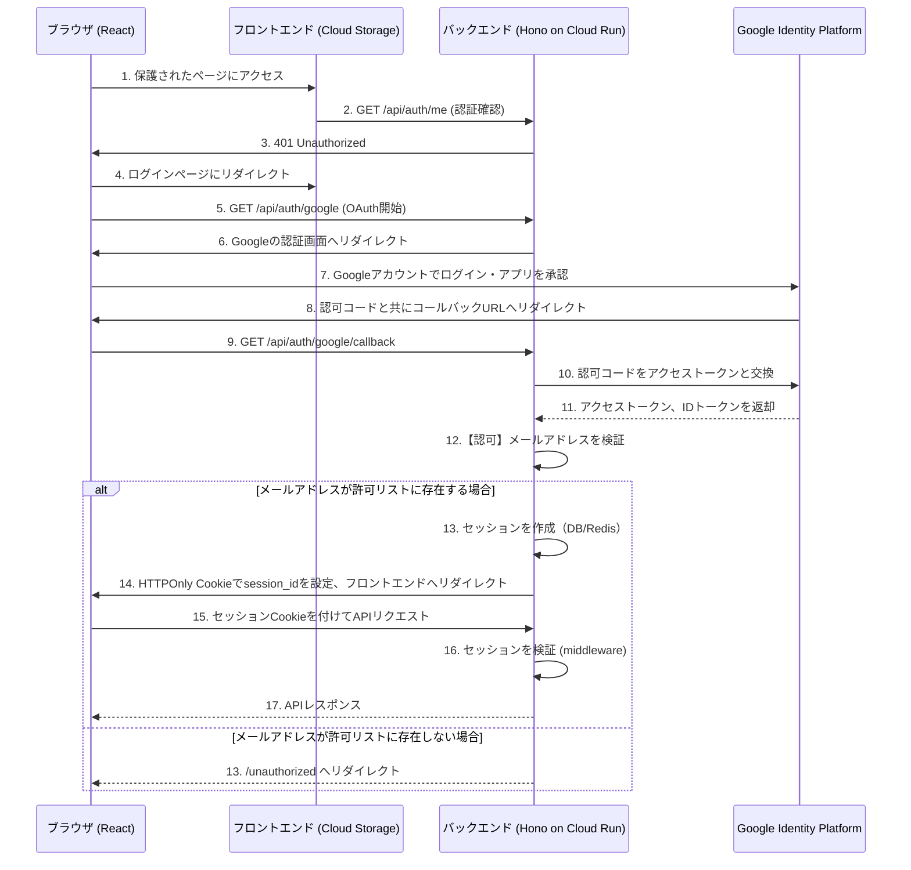

## 10. 認証・認可

Honoの`@hono/oauth-providers`を利用して、Googleアカウントによる認証・認可を実装します。認可ロジックとして、Secret Managerに保存された静的なメールアドレスリストを用いて、許可されたユーザーのみがアクセスできるように制御します。セッション管理はHTTPOnly Cookieで行います。

### 10.1. 認証・認可フロー



### 10.2. OpenTofuによるインフラ構成

認証・認可に必要な情報をOpenTofuで管理します。シークレットはGoogle Secret Managerに保存し、Cloud Runサービスから安全に参照します。

#### 10.2.1. OAuth同意画面とクライアントIDの作成

```hcl
# tf/modules/auth/main.tf

# OAuth同意画面の設定
resource "google_project_service" "iap" {
  project = var.project_id
  service = "iap.googleapis.com"
}

resource "google_project_service" "secretmanager" {
  project = var.project_id
  service = "secretmanager.googleapis.com"
}

resource "google_oauth_brand" "default" {
  project          = var.project_id
  support_email    = var.user_email
  application_title = "Preschool Agent"
}

# OAuthクライアントIDの作成
resource "google_iap_client" "default" {
  project     = google_oauth_brand.default.project
  display_name = "preschool-agent-backend"
  brand       = google_oauth_brand.default.name
}
```
*Note: `google_iap_client` は汎用的なOAuthクライアントを作成するリソースとしても利用できます。*

#### 10.2.2. Secret Managerへのシークレット登録

クライアントID/シークレットに加え、**許可するユーザーのメールアドレスリスト**をSecret Managerに保存します。

```hcl
# tf/modules/auth/main.tf (続き)

resource "google_secret_manager_secret" "google_client_id" {
  project   = var.project_id
  secret_id = "google-oauth-client-id"
  replication {
    automatic = true
  }
}

resource "google_secret_manager_secret_version" "google_client_id" {
  secret      = google_secret_manager_secret.google_client_id.id
  secret_data = google_iap_client.default.client_id
}

resource "google_secret_manager_secret" "google_client_secret" {
  project   = var.project_id
  secret_id = "google-oauth-client-secret"
  replication {
    automatic = true
  }
}

resource "google_secret_manager_secret_version" "google_client_secret" {
  secret      = google_secret_manager_secret.google_client_secret.id
  secret_data = google_iap_client.default.secret
}

# 許可するメールアドレスのリストを管理するシークレット
resource "google_secret_manager_secret" "allowed_user_emails" {
  project   = var.project_id
  secret_id = "allowed-user-emails"
  replication {
    automatic = true
  }
}

# 値は tofu apply 時に変数値として渡す (例: "user1@example.com,user2@example.com")
resource "google_secret_manager_secret_version" "allowed_user_emails" {
  secret      = google_secret_manager_secret.allowed_user_emails.id
  secret_data = var.allowed_user_emails_value
}
```

### 10.3. バックエンド（Hono）実装

#### 10.3.1. 環境変数

Cloud Runサービスに以下の環境変数を設定し、Secret Managerから値を取得します。

- `GOOGLE_CLIENT_ID`: Google OAuthクライアントID
- `GOOGLE_CLIENT_SECRET`: Google OAuthクライアントシークレット
- `ALLOWED_USER_EMAILS`: アクセスを許可するメールアドレスのカンマ区切りリスト
- `FRONTEND_URL`: フロントエンドのURL（リダイレクト先）
- `SESSION_SECRET`: セッション署名用シークレット

```hcl
# tf/modules/app/main.tf (Cloud Run設定)

resource "google_cloud_run_service" "backend" {
  name     = "preschool-agent-backend"
  location = var.region

  template {
    spec {
      containers {
        image = var.container_image

        env {
          name = "GOOGLE_CLIENT_ID"
          value_from {
            secret_key_ref {
              name = google_secret_manager_secret.google_client_id.secret_id
              key  = "latest"
            }
          }
        }

        env {
          name = "GOOGLE_CLIENT_SECRET"
          value_from {
            secret_key_ref {
              name = google_secret_manager_secret.google_client_secret.secret_id
              key  = "latest"
            }
          }
        }

        env {
          name = "ALLOWED_USER_EMAILS"
          value_from {
            secret_key_ref {
              name = google_secret_manager_secret.allowed_user_emails.secret_id
              key  = "latest"
            }
          }
        }

        env {
          name  = "FRONTEND_URL"
          value = var.frontend_url
        }
      }
    }
  }
}
```

#### 10.3.2. 認証ルート実装 (`backend/src/routes/auth.ts`)

```typescript
import { Hono } from 'hono'
import { googleAuth } from '@hono/oauth-providers/google'
import { createSession, deleteSession } from '../lib/session'

const auth = new Hono()

// Google OAuth開始
auth.use('/google', googleAuth({
  client_id: process.env.GOOGLE_CLIENT_ID!,
  client_secret: process.env.GOOGLE_CLIENT_SECRET!,
  scope: ['openid', 'email', 'profile'],
}))

// Google OAuthコールバック
auth.get('/google', async (c) => {
  const user = c.get('user-google')

  // メールアドレス認可チェック
  const allowedEmails = process.env.ALLOWED_USER_EMAILS?.split(',') || []
  if (!allowedEmails.includes(user.email)) {
    console.warn(`Unauthorized access attempt by ${user.email}`)
    return c.redirect(`${process.env.FRONTEND_URL}/unauthorized`)
  }

  // セッション作成（BigQueryまたはRedisに保存）
  const sessionId = await createSession({
    email: user.email,
    name: user.name,
    picture: user.picture,
  })

  // HTTPOnly Cookieでセッション返却
  c.cookie('session_id', sessionId, {
    httpOnly: true,
    secure: true,
    sameSite: 'Lax',
    maxAge: 60 * 60 * 24 * 7, // 7日間
    path: '/',
  })

  return c.redirect(`${process.env.FRONTEND_URL}/dashboard`)
})

// ログアウト
auth.post('/logout', async (c) => {
  const sessionId = c.req.cookie('session_id')
  if (sessionId) {
    await deleteSession(sessionId)
  }
  c.cookie('session_id', '', { maxAge: 0 })
  return c.json({ success: true })
})

// 現在のユーザー情報取得
auth.get('/me', async (c) => {
  const user = c.get('user') // middlewareで設定
  if (!user) {
    return c.json({ error: 'Unauthorized' }, 401)
  }
  return c.json(user)
})

export default auth
```

#### 10.3.3. 認証ミドルウェア (`backend/src/middlewares/auth.ts`)

```typescript
import { createMiddleware } from 'hono/factory'
import { verifySession } from '../lib/session'

export const authMiddleware = createMiddleware(async (c, next) => {
  const sessionId = c.req.cookie('session_id')

  if (!sessionId) {
    return c.json({ error: { code: 'UNAUTHORIZED', message: 'Authentication required' } }, 401)
  }

  const user = await verifySession(sessionId)

  if (!user) {
    return c.json({ error: { code: 'UNAUTHORIZED', message: 'Invalid session' } }, 401)
  }

  // ユーザー情報をコンテキストに設定
  c.set('user', user)

  await next()
})
```

#### 10.3.4. セッション管理 (`backend/src/lib/session.ts`)

```typescript
import { BigQuery } from '@google-cloud/bigquery'
import { randomUUID } from 'crypto'

const bigquery = new BigQuery()

interface User {
  email: string
  name: string
  picture: string
}

// セッション作成
export async function createSession(user: User): Promise<string> {
  const sessionId = randomUUID()
  const expiresAt = new Date(Date.now() + 7 * 24 * 60 * 60 * 1000) // 7日後

  await bigquery.query({
    query: `
      INSERT INTO \`preschool_agent.sessions\` (session_id, email, name, picture, expires_at)
      VALUES (@sessionId, @email, @name, @picture, @expiresAt)
    `,
    params: {
      sessionId,
      email: user.email,
      name: user.name,
      picture: user.picture,
      expiresAt: expiresAt.toISOString(),
    },
  })

  return sessionId
}

// セッション検証
export async function verifySession(sessionId: string): Promise<User | null> {
  const [rows] = await bigquery.query({
    query: `
      SELECT email, name, picture, expires_at
      FROM \`preschool_agent.sessions\`
      WHERE session_id = @sessionId AND expires_at > CURRENT_TIMESTAMP()
    `,
    params: { sessionId },
  })

  if (rows.length === 0) {
    return null
  }

  return {
    email: rows[0].email,
    name: rows[0].name,
    picture: rows[0].picture,
  }
}

// セッション削除
export async function deleteSession(sessionId: string): Promise<void> {
  await bigquery.query({
    query: `DELETE FROM \`preschool_agent.sessions\` WHERE session_id = @sessionId`,
    params: { sessionId },
  })
}
```

### 10.4. セッションテーブル（BigQuery）

```sql
CREATE TABLE IF NOT EXISTS `preschool_agent.sessions` (
  session_id STRING NOT NULL,
  email STRING NOT NULL,
  name STRING,
  picture STRING,
  expires_at TIMESTAMP NOT NULL,
  created_at TIMESTAMP DEFAULT CURRENT_TIMESTAMP()
)
PARTITION BY DATE(created_at);
```
