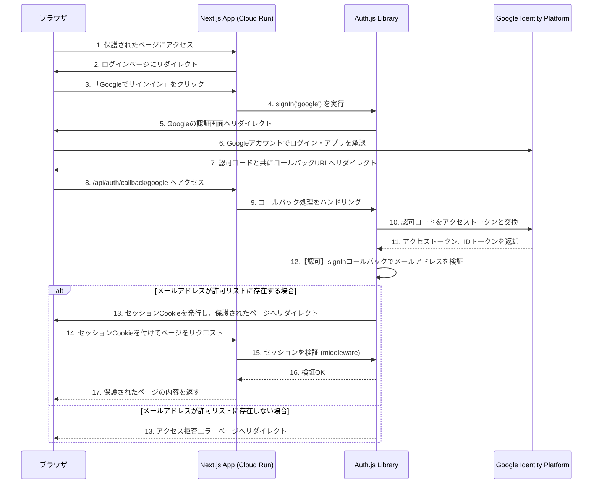

## 10. 認証・認可

Auth.js (v5) とGoogle Providerを利用して、Googleアカウントによる認証・認可を実装します。認可ロジックとして、Secret Managerに保存された静的なメールアドレスリストを用いて、許可されたユーザーのみがアクセスできるように制御します。

### 10.1. 認証・認可フロー



### 10.2. OpenTofuによるインフラ構成

認証・認可に必要な情報をOpenTofuで管理します。シークレットはGoogle Secret Managerに保存し、Cloud Runサービスから安全に参照します。

#### 10.2.1. OAuth同意画面とクライアントIDの作成

```hcl
# tf/modules/app/main.tf (抜粋)

# OAuth同意画面の設定
resource "google_project_service" "iap" {
  project = var.project_id
  service = "iap.googleapis.com"
}

resource "google_project_service" "secretmanager" {
  project = var.project_id
  service = "secretmanager.googleapis.com"
}

resource "google_oauth_brand" "default" {
  project          = var.project_id
  support_email    = var.user_email
  application_title = "Preschool Agent"
}

# OAuthクライアントIDの作成
resource "google_iap_client" "default" {
  project     = google_oauth_brand.default.project
  display_name = "preschool-agent-client"
  brand       = google_oauth_brand.default.name
}
```
*Note: `google_iap_client` は汎用的なOAuthクライアントを作成するリソースとしても利用できます。*

#### 10.2.2. Secret Managerへのシークレット登録

クライアントID/シークレット、`AUTH_SECRET`に加え、**許可するユーザーのメールアドレスリスト**をSecret Managerに保存します。

```hcl
# tf/modules/app/main.tf (抜粋)

resource "google_secret_manager_secret" "auth_google_id" {
  project   = var.project_id
  secret_id = "auth-google-id"
  replication {
    automatic = true
  }
}

resource "google_secret_manager_secret_version" "auth_google_id" {
  secret      = google_secret_manager_secret.auth_google_id.id
  secret_data = google_iap_client.default.client_id
}

resource "google_secret_manager_secret" "auth_google_secret" {
  project   = var.project_id
  secret_id = "auth-google-secret"
  replication {
    automatic = true
  }
}

resource "google_secret_manager_secret_version" "auth_google_secret" {
  secret      = google_secret_manager_secret.auth_google_secret.id
  secret_data = google_iap_client.default.secret
}

resource "google_secret_manager_secret" "auth_secret" {
  project   = var.project_id
  secret_id = "auth-secret"
  replication {
    automatic = true
  }
}

# `AUTH_SECRET`は tofu apply 時にローカルで生成した値を設定する
resource "google_secret_manager_secret_version" "auth_secret" {
  secret      = google_secret_manager_secret.auth_secret.id
  secret_data = var.auth_secret_value
}

# 許可するメールアドレスのリストを管理するシークレット
resource "google_secret_manager_secret" "allowed_user_emails" {
  project   = var.project_id
  secret_id = "allowed-user-emails"
  replication {
    automatic = true
  }
}

# 値は tofu apply 時に変数値として渡す (例: "user1@example.com,user2@example.com")
resource "google_secret_manager_secret_version" "allowed_user_emails" {
  secret      = google_secret_manager_secret.allowed_user_emails.id
  secret_data = var.allowed_user_emails_value
}
```

### 10.3. Next.jsアプリケーション側の実装

#### 10.3.1. 環境変数

Cloud Runサービスに以下の環境変数を設定し、Secret Managerから値を取得します。

- `AUTH_SECRET`: Auth.jsのセッショントークン暗号化キー
- `AUTH_GOOGLE_ID`: Google OAuthクライアントID
- `AUTH_GOOGLE_SECRET`: Google OAuthクライアントシークレット
- `ALLOWED_USER_EMAILS`: アクセスを許可するメールアドレスのカンマ区切りリスト

#### 10.3.2. Auth.js 設定 (`auth.ts`)

`signIn` コールバックを追加して、メールアドレスによる認可ロジックを実装します。

```typescript
// auth.ts
import NextAuth from "next-auth"
import Google from "next-auth/providers/google"

export const { handlers, signIn, signOut, auth } = NextAuth({
  providers: [
    Google({
      clientId: process.env.AUTH_GOOGLE_ID,
      clientSecret: process.env.AUTH_GOOGLE_SECRET,
      authorization: {
        params: {
          prompt: "consent",
          access_type: "offline",
          response_type: "code",
        },
      },
    }),
  ],
  secret: process.env.AUTH_SECRET,
  callbacks: {
    /**
     * ユーザーがサインインを試みたときに実行されるコールバック。
     * メールアドレスが許可リストに含まれているかを確認する。
     * @returns {boolean} サインインを許可する場合は true, 拒否する場合は false
     */
    async signIn({ user, account, profile }) {
      if (!profile?.email) {
        console.error("No email found in profile");
        return false; // メールアドレスがなければ拒否
      }

      const allowedEmails = (process.env.ALLOWED_USER_EMAILS || "").split(",");
      if (allowedEmails.includes(profile.email)) {
        return true; // 許可リストにあればサインインを許可
      } else {
        console.warn(`Unauthorized access attempt by ${profile.email}`);
        return false; // 許可リストになければ拒否
      }
    },
    async session({ session, token }) {
      // 必要に応じてセッション情報を拡張
      return session
    },
  },
})
```

#### 10.3.3. 認証APIルート (`app/api/auth/[...nextauth]/route.ts`)

```typescript
// app/api/auth/[...nextauth]/route.ts
import { handlers } from "@/auth"
export const { GET, POST } = handlers
```

#### 10.3.4. ミドルウェアによるルート保護 (`middleware.ts`)

`matcher`に指定されたパスへのアクセス時に認証を要求します。

```typescript
// middleware.ts
import { auth } from "@/auth"

export default auth((req) => {
  // req.auth にユーザーセッション情報が含まれる
  // 未認証の場合は自動的にログインページにリダイレクトされる
})

// See "Matching Paths" below to learn more
export const config = {
  matcher: ["/((?!api|_next/static|_next/image|favicon.ico).*)"],
}
```
