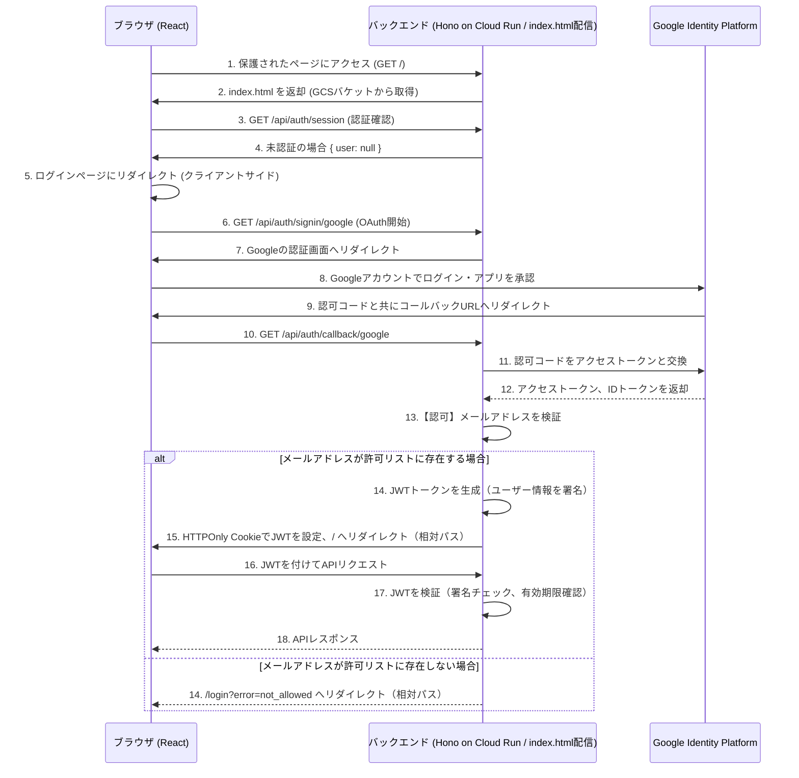

## 10. 認証・認可

Honoの`@hono/oauth-providers`を利用して、Googleアカウントによる認証・認可を実装します。認可ロジックとして、Secret Managerに保存された静的なメールアドレスリストを用いて、許可されたユーザーのみがアクセスできるように制御します。認証状態はJWTトークン（HTTPOnly Cookie）で管理し、サーバー側ストレージを必要としないステートレスな実装とします。

### 10.1. 認証・認可フロー



### 10.2. OpenTofuによるインフラ構成

認証・認可に必要な情報をOpenTofuで管理します。シークレットはGoogle Secret Managerに保存し、Cloud Runサービスから安全に参照します。

#### 10.2.1. OAuth同意画面とクライアントIDの作成

```hcl
# tf/modules/auth/main.tf

# OAuth同意画面の設定
resource "google_project_service" "iap" {
  project = var.project_id
  service = "iap.googleapis.com"
}

resource "google_project_service" "secretmanager" {
  project = var.project_id
  service = "secretmanager.googleapis.com"
}

resource "google_oauth_brand" "default" {
  project          = var.project_id
  support_email    = var.user_email
  application_title = "Preschool Agent"
}

# OAuthクライアントIDの作成
resource "google_iap_client" "default" {
  project     = google_oauth_brand.default.project
  display_name = "preschool-agent-backend"
  brand       = google_oauth_brand.default.name
}
```
*Note: `google_iap_client` は汎用的なOAuthクライアントを作成するリソースとしても利用できます。*

#### 10.2.2. Secret Managerへのシークレット登録

クライアントID/シークレットに加え、**許可するユーザーのメールアドレスリスト**をSecret Managerに保存します。

```hcl
# tf/modules/auth/main.tf (続き)

resource "google_secret_manager_secret" "google_client_id" {
  project   = var.project_id
  secret_id = "google-oauth-client-id"
  replication {
    automatic = true
  }
}

resource "google_secret_manager_secret_version" "google_client_id" {
  secret      = google_secret_manager_secret.google_client_id.id
  secret_data = google_iap_client.default.client_id
}

resource "google_secret_manager_secret" "google_client_secret" {
  project   = var.project_id
  secret_id = "google-oauth-client-secret"
  replication {
    automatic = true
  }
}

resource "google_secret_manager_secret_version" "google_client_secret" {
  secret      = google_secret_manager_secret.google_client_secret.id
  secret_data = google_iap_client.default.secret
}

# 許可するメールアドレスのリストを管理するシークレット
resource "google_secret_manager_secret" "allowed_user_emails" {
  project   = var.project_id
  secret_id = "allowed-user-emails"
  replication {
    automatic = true
  }
}

# 値は tofu apply 時に変数値として渡す (例: "user1@example.com,user2@example.com")
resource "google_secret_manager_secret_version" "allowed_user_emails" {
  secret      = google_secret_manager_secret.allowed_user_emails.id
  secret_data = var.allowed_user_emails_value
}

# JWT署名用シークレット
resource "google_secret_manager_secret" "jwt_secret" {
  project   = var.project_id
  secret_id = "jwt-secret"
  replication {
    automatic = true
  }
}

# 値は tofu apply 時に生成した256ビット以上のランダム文字列を渡す
resource "google_secret_manager_secret_version" "jwt_secret" {
  secret      = google_secret_manager_secret.jwt_secret.id
  secret_data = var.jwt_secret_value
}
```

### 10.3. バックエンド（Hono）実装

#### 10.3.1. 環境変数

Cloud Runサービスに以下の環境変数を設定し、Secret Managerから値を取得します。

- `AUTH_GOOGLE_ID`: Google OAuthクライアントID
- `AUTH_GOOGLE_SECRET`: Google OAuthクライアントシークレット
- `ALLOWED_USER_EMAILS`: アクセスを許可するメールアドレスのカンマ区切りリスト
- `AUTH_SECRET`: JWT署名用シークレット（256ビット以上のランダム文字列）
- `FRONTEND_BUCKET_NAME`: フロントエンド静的ファイル用GCSバケット名（index.html取得用）

> **Note**: `FRONTEND_URL` は不要です。backendがindex.htmlを配信する同一オリジン構成のため、OAuth callback後のリダイレクトは相対パス（`/`, `/login`）で行います。開発時のみ `FRONTEND_URL` を `.env` に設定し、Vite dev server (`http://localhost:5173`) にリダイレクトします。

実際のTerraform設定は `tf/modules/app/main.tf` を参照してください（Cloud Run v2 APIを使用）。

#### 10.3.2. 認証ルート実装 (`backend/src/routes/auth.ts`)

```typescript
import { Hono } from 'hono'
import { googleAuth } from '@hono/oauth-providers/google'
import { sign } from 'hono/jwt'

const auth = new Hono()

// Google OAuth開始
auth.use('/google', googleAuth({
  client_id: process.env.GOOGLE_CLIENT_ID!,
  client_secret: process.env.GOOGLE_CLIENT_SECRET!,
  scope: ['openid', 'email', 'profile'],
}))

// Google OAuthコールバック
auth.get('/google', async (c) => {
  const user = c.get('user-google')

  // メールアドレス認可チェック
  const allowedEmails = process.env.ALLOWED_USER_EMAILS?.split(',') || []
  if (!allowedEmails.includes(user.email)) {
    console.warn(`Unauthorized access attempt by ${user.email}`)
    return c.redirect('/login?error=not_allowed')
  }

  // JWTトークン生成
  const token = await sign(
    {
      email: user.email,
      name: user.name,
      picture: user.picture,
      exp: Math.floor(Date.now() / 1000) + 60 * 60 * 24 * 7, // 7日間有効
    },
    process.env.JWT_SECRET!
  )

  // HTTPOnly CookieでJWT返却
  c.cookie('auth_token', token, {
    httpOnly: true,
    secure: true,
    sameSite: 'Lax',
    maxAge: 60 * 60 * 24 * 7, // 7日間
    path: '/',
  })

  // 同一オリジンなので相対パスでリダイレクト
  return c.redirect('/')
})

// ログアウト
auth.post('/logout', (c) => {
  // Cookieを削除するだけ（JWTはステートレス）
  c.cookie('auth_token', '', { maxAge: 0 })
  return c.json({ success: true })
})

// 現在のユーザー情報取得
auth.get('/me', async (c) => {
  const user = c.get('user') // middlewareで設定
  if (!user) {
    return c.json({ error: 'Unauthorized' }, 401)
  }
  return c.json(user)
})

export default auth
```

#### 10.3.3. 認証ミドルウェア (`backend/src/middlewares/auth.ts`)

```typescript
import { createMiddleware } from 'hono/factory'
import { verify } from 'hono/jwt'

export const authMiddleware = createMiddleware(async (c, next) => {
  const token = c.req.cookie('auth_token')

  if (!token) {
    return c.json({ error: { code: 'UNAUTHORIZED', message: 'Authentication required' } }, 401)
  }

  try {
    // JWT検証（署名チェック + 有効期限確認）
    const payload = await verify(token, process.env.JWT_SECRET!)

    // ユーザー情報をコンテキストに設定
    c.set('user', {
      email: payload.email,
      name: payload.name,
      picture: payload.picture,
    })

    await next()
  } catch (error) {
    // JWT検証失敗（署名不正または期限切れ）
    return c.json({ error: { code: 'UNAUTHORIZED', message: 'Invalid or expired token' } }, 401)
  }
})
```

### 10.4. JWT利点とセキュリティ考慮事項

#### 利点

1. **ステートレス**: サーバー側でセッションストレージが不要
2. **スケーラブル**: インスタンス間で状態共有が不要
3. **シンプル**: 署名検証のみで認証完了
4. **低コスト**: Redis/Memorystore/BigQueryなどのストレージ不要
5. **低レイテンシ**: ネットワークIOなしで検証完了

#### セキュリティ考慮事項

1. **HTTPOnly Cookie**: XSS攻撃からトークンを保護
2. **Secure属性**: HTTPS通信のみでCookieを送信
3. **SameSite=Lax**: CSRF攻撃を緩和
4. **有効期限**: トークンに`exp`クレームを設定（7日間）
5. **トークン無効化**: ログアウト時にCookieを削除（サーバー側では無効化不可）

#### トークン無効化の制限

JWTはステートレスであるため、以下の場合にトークンを即座に無効化できません：

- ユーザーの権限変更（メールアドレスリストから削除）
- セキュリティ侵害時の緊急トークン無効化

**対策:**
- 短い有効期限を設定（7日間）
- 必要に応じてトークンブラックリスト機能を追加（Redis等で管理）
