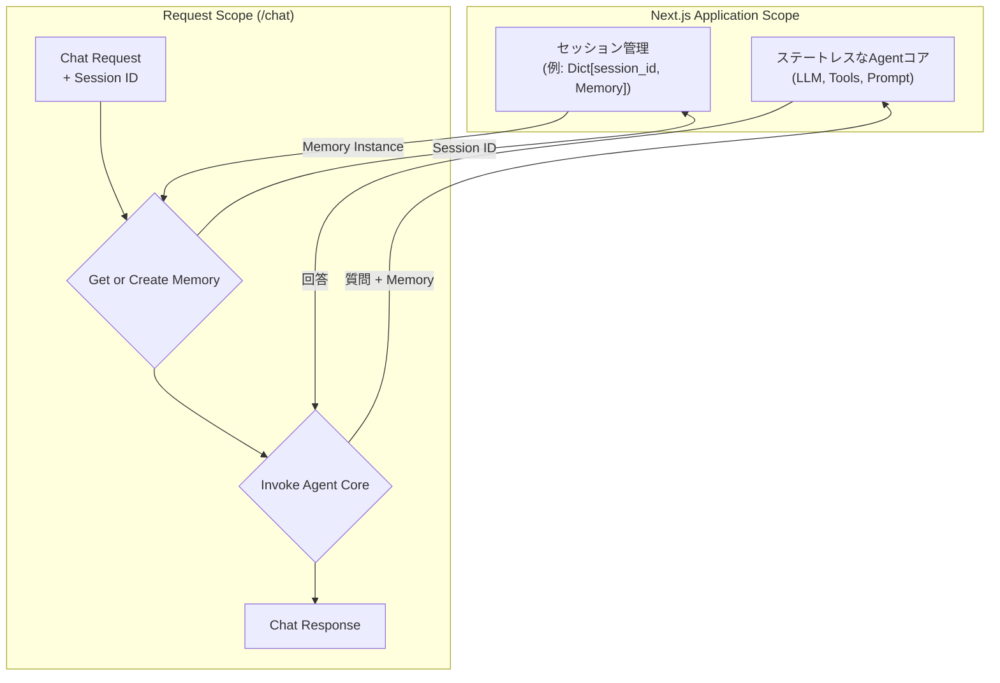

## 11. RAGエージェント設計 (VoltAgent)

`POST /chat` エンドポイントは、ユーザーからの自然言語での問い合わせに応答するRAG (Retrieval-Augmented Generation) エージェントとして機能する。このエージェントはVoltAgentを用いて構築し、Next.jsアプリケーションに組み込む。

### 11.1. アーキテクチャと状態管理

複数ユーザー・複数セッションからの同時アクセスを安全に処理するため、エージェントの状態管理を明確に分離する。会話履歴のようなステートフルなコンポーネント (`Memory`) はセッションごとに独立させ、エージェントのコアロジックはステートレスなシングルトンとして実装する。

### 11.2. コンポーネント詳細

#### 11.2.1. LLM (大規模言語モデル)

-   **実装**: VoltAgentが提供するLLMラッパーを介して、Googleの **Gemini** モデルを利用する。
-   **役割**: `BigQuery Retriever Tool` によって検索されたコンテキスト情報、プロンプトテンプレート、および会話履歴に基づき、自然で適切な回答を生成する。

#### 11.2.2. BigQuery Retriever Tool

-   **実装**: VoltAgentの`Tool`クラスを継承したカスタムツールとして実装する。このツールは、内部でTypeScript用の `@google-cloud/bigquery` ライブラリを使用する。
-   **役割**: RAGの「Retriever」としての責務を担う。
-   **処理フロー**:
    1.  エージェントからユーザーの質問文字列を受け取る。
    2.  質問内容からキーワードやエンティティを抽出し、検索条件を組み立てる。（初期実装では単純なキーワードマッチングとし、将来的にLLMを用いたより高度なクエリ生成も検討する）
    3.  `documents`, `journal`, `monthly_announcement` など、複数のBigQueryテーブルに対し、テキストカラムを対象とした `SELECT` 文（`WHERE ... LIKE ...`）を実行する。
    4.  得られた検索結果（テーブルの行データ）を、LLMが理解しやすいように整形されたテキスト（コンテキスト情報）に変換してエージェントに返す。

#### 11.2.3. Memory (会話履歴)

-   **実装**: VoltAgentが提供する標準のインメモリ会話バッファ（例: `ConversationBufferMemory`）を利用する。
-   **役割**: ユーザーセッションごとの短期的な会話の文脈を維持する。このインスタンスはステートフルであり、セッションごとに独立して生成・管理される。

#### 11.2.4. Agent Core (エージェントコア)

-   **実装**: LLM、ツール群 (`BigQuery Retriever Tool`など)、プロンプトテンプレートから構成される、**ステートレス**なコンポーネント。
-   **役割**: リクエストごとに、外部から渡される `Memory` インスタンスとユーザーの質問に基づき、応答生成のオーケストレーションを行う。このコア部分は状態を持たないため、アプリケーション全体でシングルトンとして安全に共有できる。

### 11.3. Next.jsとの連携

-   **起動時**:
    -   ステートレスな `Agent Core` を一度だけ初期化する。
    -   セッションごとの `Memory` インスタンスを保持するためのグローバルな辞書 (`sessions: Dict[str, Memory] = {}`) を準備する。
-   **リクエスト処理 (`/api/chat`)**:
    1.  リクエスト（ヘッダーやボディ）からセッションIDを取得する。セッションIDがない場合は新規に発行する。
    2.  セッションIDをキーに、グローバルな辞書から対応する `Memory` インスタンスを取得する。存在しない場合は新しい `Memory` インスタンスを作成し、辞書に格納する。
    3.  `Agent Core` の実行メソッドに、ユーザーの質問と取得した `Memory` インスタンスを渡して呼び出す。
    4.  生成された応答をJSON形式でクライアントに返す。
